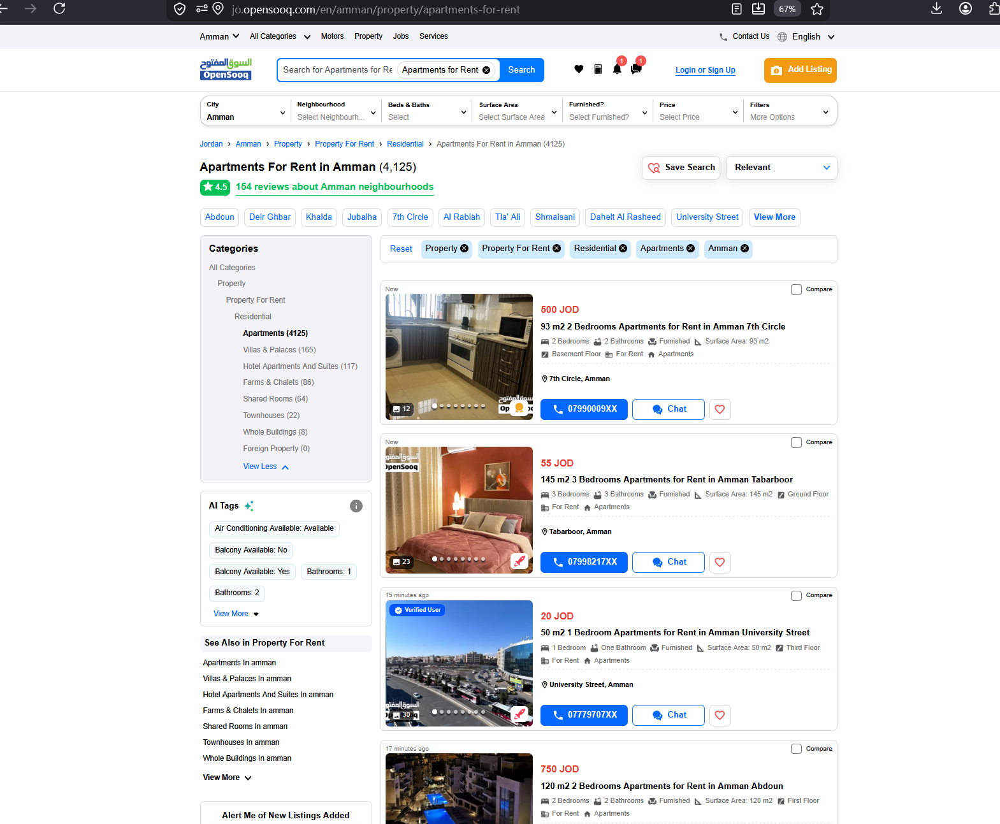
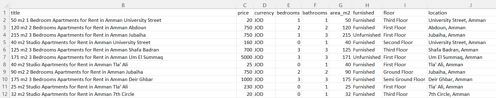

# OpenSooq Jordan Apartment Scraper

Scrapes apartment-for-rent listings from OpenSooq Jordan and exports them to a clean CSV — useful for real estate market research, rental analytics, or relocation planning across Amman.

The site is JavaScript-rendered and blocks plain `requests`, so this uses **Playwright** to drive a real Chromium browser.

## What it does
- Scrapes 5 pages of listings (~150 results) from OpenSooq Jordan
- Extracts: listing ID, title, price (JOD), bedrooms, bathrooms, area (m²), furnished status, floor, location, listing URL
- Handles JavaScript-rendered content via Playwright
- Walks pagination (`?page=2`, `?page=3`, …) automatically
- Deduplicates listings across pages
- Outputs a clean CSV ready for Excel / Google Sheets / pandas

## Before


## After


## Sample output

| title | price (JOD) | bedrooms | area (m²) | location |
|---|---|---|---|---|
| 50 m2 1 Bedroom Apartments for Rent in Amman University Street | 20 | 1 | 50 | University Street, Amman |
| 120 m2 2 Bedrooms Apartments for Rent in Amman Abdoun | 750 | 2 | 120 | Abdoun, Amman |
| 215 m2 3 Bedrooms Apartments for Rent in Amman Jubaiha | 750 | 3 | 215 | Jubaiha, Amman |

Full results in `listings.csv`.

## Usage

```bash
pip install playwright pandas beautifulsoup4
python -m playwright install chromium
python scraper.py
```

Output saved to `listings.csv`.

## Configuration

Edit the constants at the top of `scraper.py`:

- `BASE_URL` — change city / category (Zarqa, Irbid, villas, lands, etc.)
- `NUM_PAGES` — how many pages to scrape (default 5 → ~150 listings)
- `OUTPUT_FILE` — output CSV path

## Tech
Python · Playwright · BeautifulSoup · pandas
